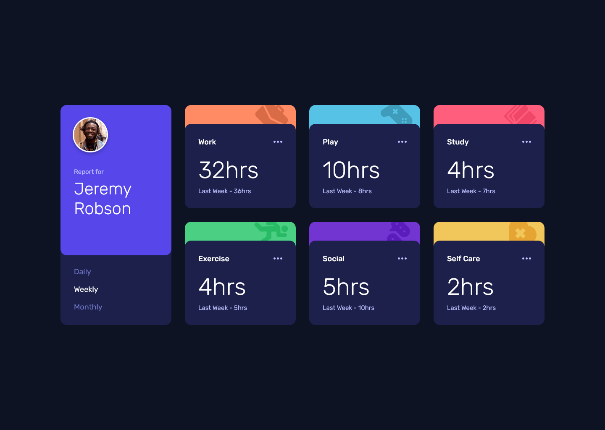

# Frontend Mentor - Time tracking dashboard solution

This is a solution to the [Time tracking dashboard challenge on Frontend Mentor](https://www.frontendmentor.io/challenges/time-tracking-dashboard-UIQ7167Jw). Frontend Mentor challenges help you improve your coding skills by building realistic projects. 

## Table of contents

- [Overview](#overview)
  - [The challenge](#the-challenge)
  - [Screenshot](#screenshot)
  - [Links](#links)
- [My process](#my-process)
  - [Built with](#built-with)
  - [What I learned](#what-i-learned)
  - [Useful resources](#useful-resources)
- [Author](#author)

## Overview

### The challenge

Users should be able to:

- View the optimal layout for the site depending on their device's screen size
- See hover states for all interactive elements on the page
- Switch between viewing Daily, Weekly, and Monthly stats

### Screenshot



### Links

- Solution URL: [Add solution URL here](https://www.frontendmentor.io/solutions/)
- Live Site URL: [Add live site URL here](https://alexander3717.github.io/TimeTrackingDashboard/)

## My process

### Built with

- Semantic HTML5 markup
- SASS features
- CSS custom properties
- Flexbox
- CSS Grid
- Vanilla JavaScript
- Mobile-first workflow

### What I learned

If you want the children of an element placed in your CSS grid (you could say grandchildren) to follow the structure of that grid, you can set `display: contents` on the element, which will make it act like its not there and its children will become grid items.

Or you can use `subgrid` on the element, choose which area of the original grid it should span and the element will then use the parent's grid lines within that area to lay out its own children.

This one is more complicated but it's what I used in this challenge because it was probably better for accessibility.

Here is why I had to use it in the first place:

I wanted the "Report for Jeremy Robson" card to be `<header>`. And the tracking cards to be inside `<main>`. In the desktop layout, *all* cards should be equally wide. To achieve that, they all need to be controlled by the same grid. But how can I do that with a HTML structure like this?

```html
<body> <!-- body is the grid -->
  <header></header> <!-- header is the "Report for card" -->

  <main> <!-- tracking cards are inside main -->
    <div class="tracking-card1"></div> 
    ...
    <div class="tracking-card6"></div>
  </main>
</body>
```

`<header>` and children of `<main>` are not siblings, so I cannot simply do it.

That's why I used `subgrid` on `<main>`, which allowed its children (the tracking cards) to use `<body>`s grid tracks.

So now both `<header>` and children of `<main>` are inside the grid, following the same grid rules and I can make them equally wide with `grid-template-columns: repeat(4, 1fr)`.

```scss
body {
    display: grid;
    grid-template-columns: repeat(4, 1fr);
    // rest of properties here
}

main {
    display: grid; // the subgrid needs to have display: grid as well

    // you set the subgrid keyword on grid-template-columns, grid-template-rows or both
    // in this case I needed it on grid-template-columns
    grid-template-columns: subgrid;

    grid-column: 2 / -1;
    // this says in which area of the parent grid should the subgrid lay out its children
    // it then lays them out in this area according to the parents grid lines
}

header { // positions the "Report for" card according to the desktop design
    grid-column: 1;
    grid-row: 1 / -1;
    align-self: stretch;
}
```

On the JavaScript side, this challenge introduced me to promises and working with JSON. I am looking forward to learning more about these in future challenges because here I barely scratched the surface.

### Useful resources

- [Fixes for backgroud color bleed in rounded corners](https://dev.to/rashidshamloo/css-fixing-background-color-bleed-in-rounded-corners-2kh4) - This directly addresses a rendering issue I encountered when styling the tracking cards. I went with the linear-gradient fix.
- [Free CSS Grid course](https://cssgrid.io/) - I did the whole course, it gives you a solid foundation for working with grid (though it's a bit older and doesn't cover subgrid)

## Author

- Frontend Mentor - [@Alexander3717](https://www.frontendmentor.io/profile/Alexander3717)
